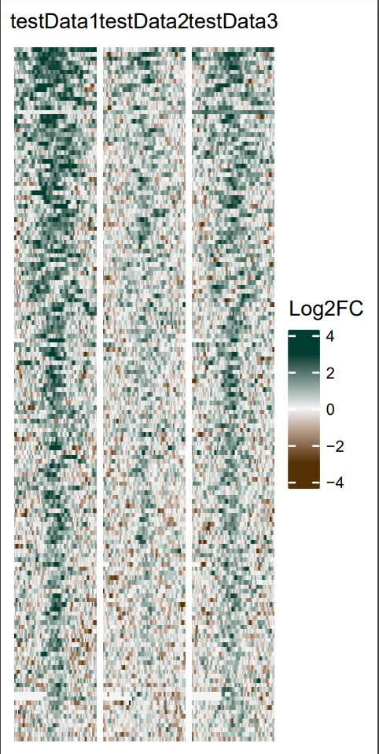
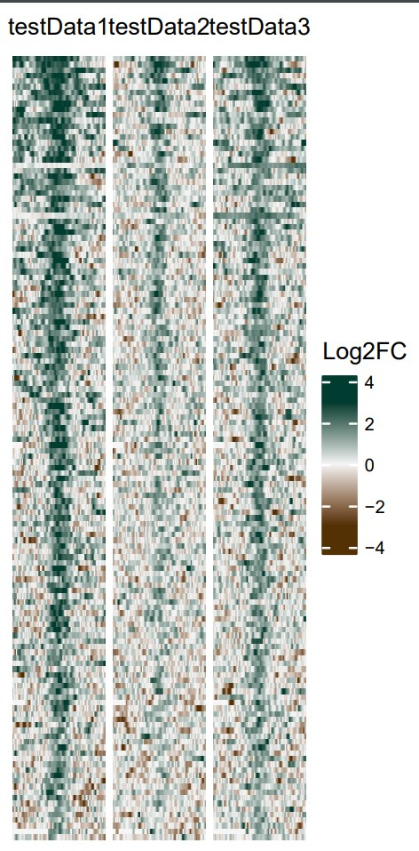
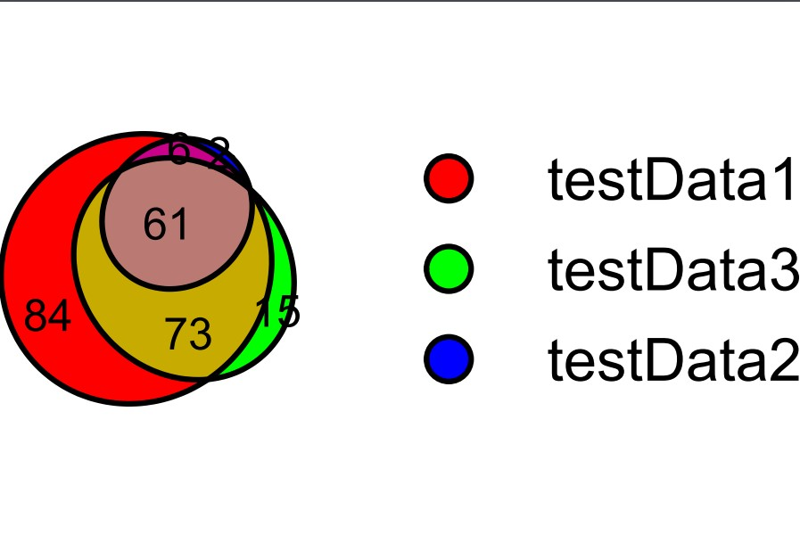
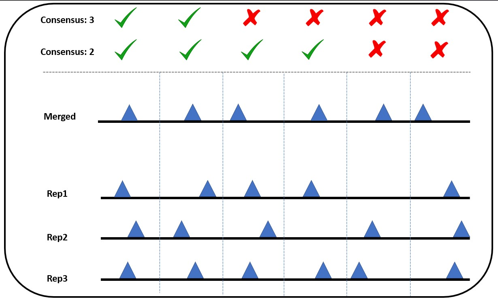

[](https://zenodo.org/badge/latestdoi/526745082)

# ReplicatePeakAnalyzer
Process for merging both technical and biological replicates. This pipeline will also analyze peaks from replicate samples of ChipSeq or Cut&amp;Run Experiment to produce heat plots and euler plots. 


<sub>Green Global Travel. (2021). Mount Everest, Nepal/Tibet [Photograph]. Retrieved from https://greenglobaltravel.com/tallest-mountains-in-the-world/</sub>

# Process
1.  Merge replicate treatment and input downsampled bams.
2.  Call peaks on merged bams. These are the [merged](#merged-peak-calling) peaks.
3.  Identify merged that overlap peaks in each sample.
4.  Make a [heat plot](#heat-plots) showing coverage of all merged peaks with merged data.
5.  Make a [heat plot](#heat-plots) showing coverage of all merged peaks for each sample. 
6.  Make a [Euler plot](#euler-plot) showing overlap of the sample peaks.
7.  Make an Upset plot showing overlap of the sample peaks.
8.  Make a report.

# Input
1. List of .bam files

# Output
1. Merged .bam files
2. Heat map of braod peaks
3. Heat map of narrow peaks
4. Euler plot of peaks overlapped

# Direcitons to run pipeline

## 1. Load modules
```bash
# make sure no modules are already loaded
module purge
# load moduels to run snakemake
module load slurm python/3.7.0  pandas/1.0.3  numpy/1.18.2
```

## 2. Clone Github
```bash
# once you are in the directory you would like to work clone the github repo
git clone git@github.com:kevinboyd76/ReplicatePeakAnalyzer.git

# Step below to rename the folder are not necessary but can help organize your files
# rename folder with project name
mv ReplicatePeakAnalyzer/ My_Project_Folder/

# change directory into root of your project folder
# You will need to be in this directory to run the snakefile
cd My_Project_Folder/
```


## 3A. Modify the config/samples.csv file
Note. Make sure to rename sample file by removing "_template"


5. Fill the fourth column labeled "Set" with the appropriate indicator for each sample. This column will identify the set that each sample belongs to. Samples with the same indicator in the "Set" column will be considered part of the same set and used to generate a consensus peakset. The desired number of samples with overlapping peaks is specified in the config.yml file.

1. Open the "samples.csv" file located in the "/config" folder.
2. In the first column labeled "sample", enter a unique name for each sample. These names will be used to identify the samples and establish the naming convention for the samples going forward.
3. In the second column labeled "treatmentBam", replace the existing filenames and paths with the names and paths of your desired treatment BAM files.
4. In the third column labeled "inputBam", replace the existing filenames and paths with the names and paths of your desired input BAM files.
5. Fill the fourth column labeled "set" with an appropriate indicator for each sample. This indicator will determine the sample's set membership. Samples with the same indicator in the "set" column will be considered part of the same set and are used to generate a consensus peak set. The desired number of samples with overlapping peaks to generate a consensus peakset is specified in the "config.yml" file.


| sample      | treatmentBam                   | inputBam                        | set        |
|-------------|--------------------------------|---------------------------------|------------|
| testData1A  | resources/testData/test1.bam   | resources/testData/input1.bam   | testSet1   |
| testData1B  | resources/testData/test1B.bam  | resources/testData/input1.bam   | testSet1   |
| testData2A  | resources/testData/test2.bam   | resources/testData/input2.bam   | testSet2   |
| testData2B  | resources/testData/test2B.bam  | resources/testData/input2B.bam  | testSet2   |


#### 3B. IF SLURM RESOURCE CHANGES ARE NEEDED. Modify the config/cluster_config.yml file

CPU and memory requests for each rule in the pipeline are detailed in this file. If you are using SLURM, you may need to alter this file to fit your needs/system.


### 4. Do a dry run
A dry run produces a text output showing exactly what commands will be executed. Look this over carefully before submitting the full job. It is normal to see warnings about changes made to the code, input, and params
```bash
snakemake -npr
```


## 5. Submit job to cluster
```bash
sbatch --constraint=westmere \
--wrap="\
snakemake \
-R \
-p \
-j 999 \
--use-envmodules \
--latency-wait 100 \
--cluster-config config/cluster_config.yml \
--cluster '\
sbatch \
-A {cluster.account} \
-p {cluster.partition} \
--cpus-per-task {cluster.cpus-per-task}  \
--mem {cluster.mem} \
--output {cluster.output} \
--error {cluster.error} \
--time {cluster.time}'"
```

# Output Examples:

# Heat Plots
Midpoints                                               |  PeakSummits
:------------------------------------------------------:|:----------------------------------------------------------------------:
  |  


# Euler Plot


# Merged Peak Calling
Visualization of calling peaks based on peaks found in either 2 or 3 replicates



## Extra:

Parameters:
|Parameter|Description|Value|
|---------|-----------|-----|
|MACS_q_value|q-value (minimum FDR) cutoff for macs peak calling|(Integer)|
|broad_peaks|run macs with broad peaks or not|True or False|


### Call peaks on individual samples.
```bash
macs2 callpeak \
-t {input.txBam} \
-c {input.inBam} \
-f BAMPE \
-g {params.effective_genome_size} \
-n {params.sample_name}_{params.minimum_FDR_cutoff} \
-q {params.minimum_FDR_cutoff} \
--outdir results/macs2_normalPeaks/
```
### Downsample treatment and input bams to the minimum read count for each replicate set.
#### Write read counts for each treatment and input sample
```bash
samtools idxstats {input.txBam} | awk -F '\t' '{s+=$3}END{print s}' > {output.treatmentCountFile}
samtools idxstats {input.inBam} | awk -F '\t' '{s+=$3}END{print s}' > {output.inputCountFile}
```
#### Get minimum read count for each replicate set
```bash
cat 
```

